# 🛠 End to End Credit Scoring System on Customized Kubeflow Platform
An platform for Data Science team to build and serve ML model using multi cloud environment (GCP and Azure) with CI/CD pipeline, monitoring. This project leverages Kubeflow, MLflow, Minio, Prometheus, Grafana, Evidently and FastAPI to build a complete a ML system. 

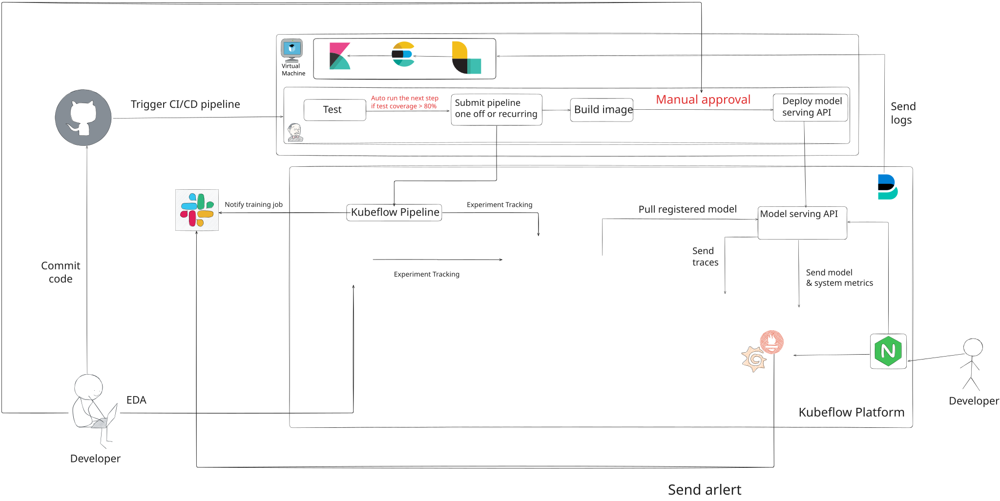

**Disclaimer**: This is a version 1.2 of this project, I will keep updating this project to make it more complete and useful.

## To-Do
- [ ] Implement Data Ingestion, Data Quality check, Data Lake, Data Warehouse, and Data Pipeline in AKS
- [ ] Implement Kafka, Flink and Spark for Data Pipeline
- [ ] Implement online and offline feature store

## 📑 Table of Contents
  - [Repository structure](#repository-structure)
  - [Architecture Overview](#architecture-overview)
    - [1. Data pipeline](#1-data-pipeline)
      - [1.1. Data Ingestion](#1.1-data-ingestion)
      - [1.2. Data Quality Check](#1.2-data-quality-check)
      - [1.3. Data Lake](#1.3-data-lake)
      - [1.4. Data Warehouse](#1.4-data-warehouse)
    - [2. Training pipeline](#2-training-pipeline)
    - [3. Serving pipeline](#3-serving-pipeline)
    - [4. Monitoring](#4-monitoring)
  - [Details](#details)
    - [Setting GKE cluster](#setting-gke-cluster)
    - [Component Preparation](#component-preparation)
      - [Slack](#slack)
      - [Kubeflow](#kubeflow)
      - [Ingress controller](#ingress-controller)
      - [Minio](#minio)
      - [MLflow](#mlflow)
      - [Prometheus and Grafana](#prometheus-and-grafana)
      - [Evidently](#evidently)
      - [Jaeger](#jaeger)
      - [API Endpoint](#api-endpoint)
    - [Kubeflow usage](#kubeflow-usage)
      - [Kserve](#kserve)
      - [Using Kubeflow Pipeline](#using-kubeflow-pipeline)
      - [Katib](#katib)
      - [Config Kubeflow Central Dashboard](#config-kubeflow-central-dashboard)
    - [Setting Azure VM](#setting-azure-vm)
      - [ELK Stack](#elk-stack)
      - [Jenkins](#jenkins)
      - [Jenkins Pipeline](#jenkins-pipeline)


## Repository structure
```txt
Root
├── dockerfiles                         *  All Dockerfiles for the project
├── helm-charts                         *  Helm charts for deploying components in this project      
│   ├── api                             *  Custom Helm chart for the API component                
│   ├── jaeger                          *  Custom Helm chart for Jaeger               
│   ├── minio                           *  Custom Helm chart for MinIO
│   ├── mlflow                          *  Custom Helm chart for MLflow
│   ├── monitoring                      *  Custom Helm chart for Prometheus and Grafana
│   └── evidently                       *  Custom Helm chart for Evidently
├── filebeat                            
│   └── filebeat-kubernetes.yaml        *  Filebeat manifest
├── kubeflow                            *  Kubeflow deployment files
│   ├── dashboard                       *  Custom Kubeflow Central Dashboard
│   ├── kfp-access                      *  Custom Kubeflow Pipelines access in Notebook
│   ├── kind.yaml
│   ├── manifests                       *  Kubeflow manifests v1.10
│   ├── notebook                        *  Custom Kubeflow Notebook 
│   ├── patch_vs.sh                     *  Script to patch the Kubeflow virtualservice and gateway
│   └── svc_mesh                        *  Istio service mesh to export Kubeflow services
├── LICENSE
├── media                               *  Media files for the project                      
├── README.md
├── src                                 *  Source code for the project
│   ├── client                          *  Client code for the project
│   ├── kubeflow_nb                     *  Model code from Kubeflow Notebook
│   └── ui                              *  UI code for the project
├── terraform                           *  Terraform files for deploying the project
│   ├── aks                             *  Deploying infrastructure in AKS
│   ├── azure_vm                        *  Deploying Jenkins, ELK in Azure VM 
│   └── gke                             *  Deploying infrastructure in GKE
├── tests                               *  Testing files for the project
└── Jenkinsfile                         *  Jenkins pipeline file for CI/CD                                         
```

## Architecture Overview
### Data pipeline
Firstly, I'm using the dataset from Kaggle [Home Creadit Default Risk](https://www.kaggle.com/competitions/home-credit-default-risk/data) to build a undewriting system. The dataset is used to train a machine learning model to predict whether to approve a loan application or not. I already downloaded this data to my Gdrive, you can download it by running the following command:
```bash
mkdir -p data
gdown --folder "https://drive.google.com/drive/folders/1HCoHY7N0GGCIqFouF3mx9cVKY35Z-p44?usp=drive_link" -O ./data
```

After that, the data is upload to Minio bucket `sample-data` in Minio deployment, to deploy and upload data to Minio, navigate to this section [Minio](#minio)


#### 1. Data Ingestion (Under implementation)
##### 1.1 Data Ingestion
##### 1.2 Data Quality Check
##### 1.3 Data Lake
##### 1.4 Data Warehouse

### 2. Training pipeline
To automate the training and logging process, I'm using Kubeflow Pipelines and Kubeflow Notebook under Kubeflow platform for an unified developing and training environment. I'm also configure Kubeflow Notebook namespace to add git and push all my codebase to this repository. You can refer to [this repo](https://github.com/dohuyduc2002/kubeflow-nb) for using Kubeflow Notebook

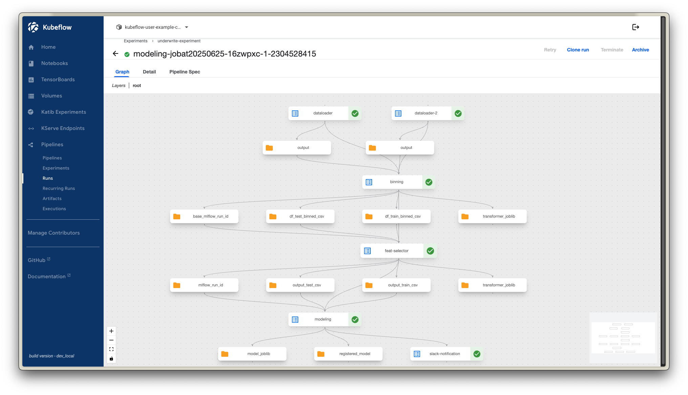
#### 3. Serving pipeline
The model is served using FastAPI to create an endpoint API for the model, the UI for model user interface is built using Streamlit. The model is served in a Kubernetes pod and exposed to the internet using Nginx ingress controller. The model is pulled from Mlflow from stage `production` to the endpoint. To use this API, user can either input `raw` data from scratch and let the model process and return the prediction to the end user. 

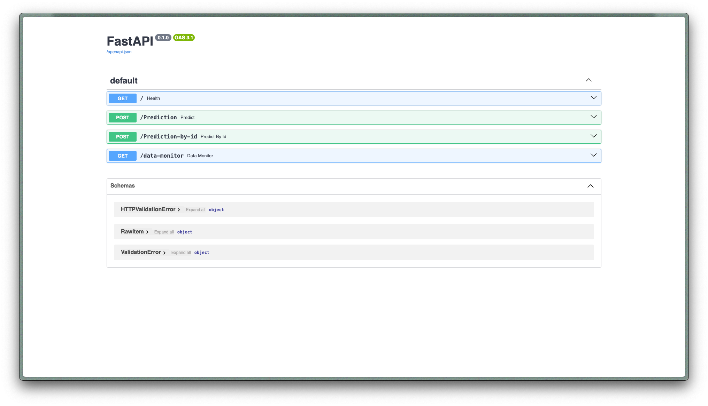

#### 4. Monitoring
After serving, we need to monitor the 2 metrics, model performance metrics and system metrics. For these metrics, I'm using Prometheus and Grafana to monitor the system. The model performance metrics is collected using Evidently. The computer metrics is collected using Prometheus Node Exporter. The monitoring dashboard is built using Grafana and exposed to the internet using Nginx ingress controller. I'm also setting up an alert manager if the system metrics is not healthy and it will send a notify to my Discord sever. 


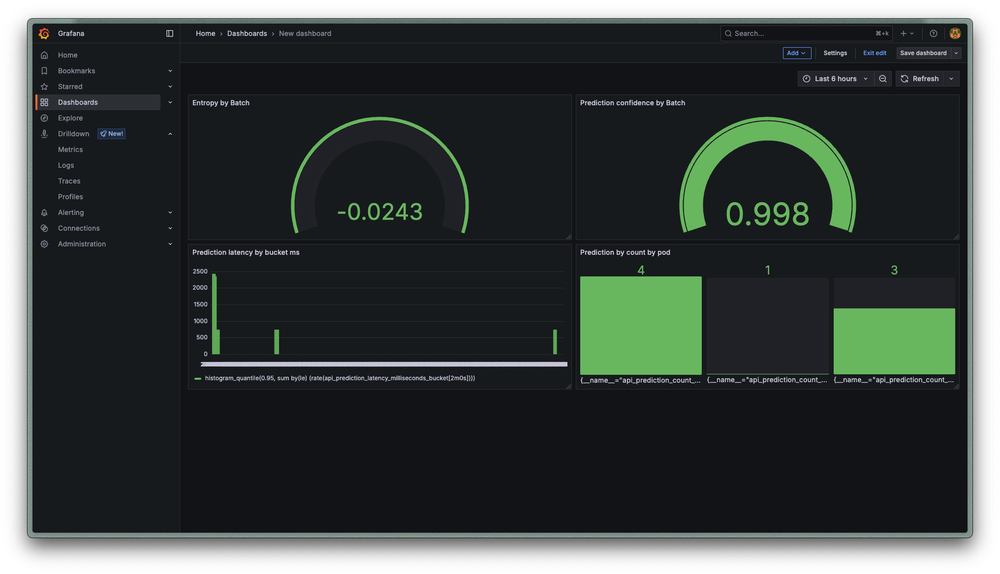
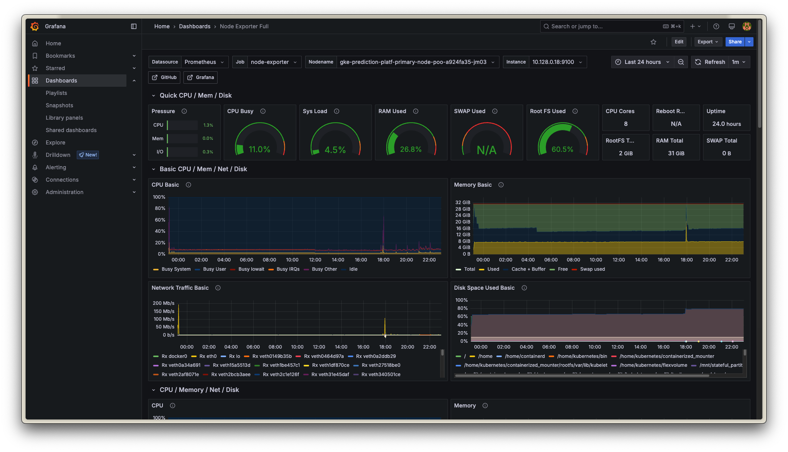

## Details
### Setting GKE cluster
#### Prerequisites
After creating GCP account, create a new project and enable billing for it. You can follow the official [GCP account registration guide](https://cloud.google.com/free/docs/free-cloud-features) to create a GCP account and set up billing.
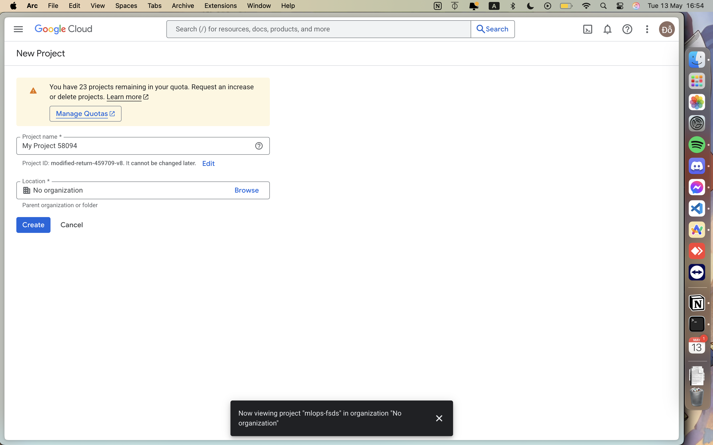
Create a new GCP project, this will be used to deploy the GKE cluster and other GCP resources, my project is `mlops-fsds` and then `enable` these API [Compute Engine API UI](https://console.cloud.google.com/marketplace/product/google/compute.googleapis.com) and [Kubernetes Engine API UI](https://console.cloud.google.com/marketplace/product/google/container.googleapis.com) 

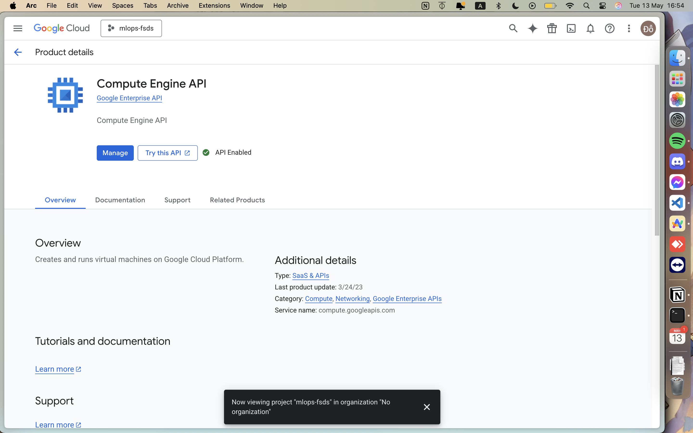

Because this project is running on GKE, you need to install gcloud cli to manage GCP resources. You can follow the official [Gcloud installation guide](https://cloud.google.com/sdk/docs/install).

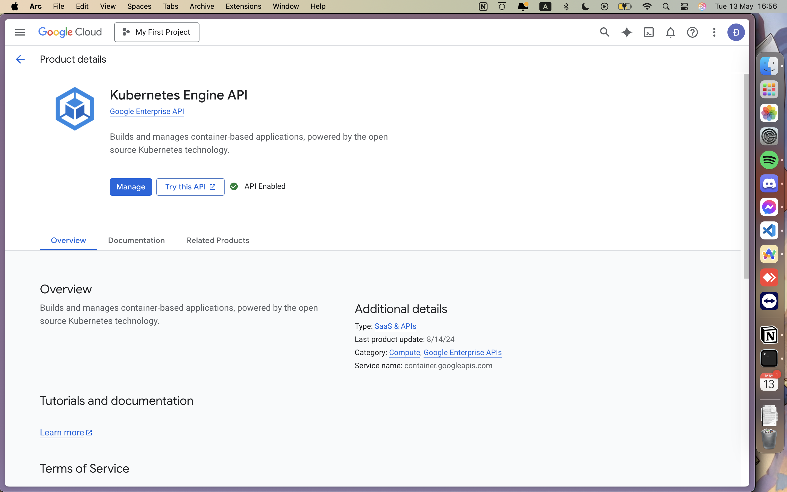

To enable usage of GCP resources, you need to create a service account and assign it the necessary roles. You can follow the official [GCP service account](https://console.cloud.google.com/iam-admin/serviceaccounts) to create a service account and assign it the necessary roles. After that, save it as a json file into `terraform/gke` folder. In this project, I'm using Kubernetes and Kustomize to deploy Kubeflow and other components. The infrastructure is managed using Terraform as IaC. Beflow is my Kubernetes configuration:
- Client Version: v1.32.3
- Kustomize Version: v5.5.0
- Server Version: v1.32.0

Since Kubernetes is written in Golang, you need to install Golang first. You can follow the official [Golang installation guide](https://golang.org/doc/install) or run the following commands:

```bash
sudo apt update
sudo apt install -y golang-go
```

Be sure to check Kustomize version cause this will be used to deploy Kubeflow. 

```bash
curl -Lo kustomize.tar.gz https://github.com/kubernetes-sigs/kustomize/releases/download/kustomize%2Fv5.5.0/kustomize_v5.5.0_linux_amd64.tar.gz
tar -xzf kustomize.tar.gz
chmod +x kustomize
sudo mv kustomize /usr/local/bin/
```

Install Krew for Kubectl plugins, you can install Krew by following this link: [Krew installation](https://krew.sigs.k8s.io/docs/user-guide/setup/install/). For convinience when using Kubeflow, you can install these Kubectl plugins and alias:
```bash
echo "alias k=kubectl" >> ~/.bashrc
source ~/.bashrc
kubectl krew install ctx
kubectl krew install ns
echo "alias kubectx='kubectl ctx'" >> ~/.bashrc
echo "alias kubens='kubectl ns'" >> ~/.bashrc
```

You can follow the official [Terraform installation guide](https://learn.hashicorp.com/tutorials/terraform/install-cli) to install Terraform.
#### Deployment
Firstly, we need to deploy our GKE cluster
```bash
cd terraform/gke

terraform init
terraform plan
terraform apply
```
The output from `outputs.tf` file will show you GKE cluster name, endpoint and project id. For this project, I'm using e2-standard-8 with 1 node which will be a back-end nodes and a routing node. I'm using default VPC network provided by GKE cluster when creating the cluster. If you prefer to use your own VPC to issue own IP address range, you can modify the `main.tf` 

After provisioning is complete, switch context to GKE cluster 
```bash
gcloud container clusters get-credentials <cluster-name> --zone <zone> --project <project-id>
```
## Component Preparation
In this section, I will guide you to install and configure all the components in this project.

### Slack
We will create a slack bot app to send notification when Kubeflow Pipeline is completed. After create slack account, go to [Slack app](https://api.slack.com/apps) to create a new app, navigate to `OAuth & Permissions` and add the following scopes:
- `chat:write`: to send message to slack channel
- `incoming-webhook`: to post message to slack channel 

After that, copy the slack bot token `xoxb-abcxyz` and add it to your slack channel. This bot will send notification to slack when Kubeflow Pipeline is completed. 

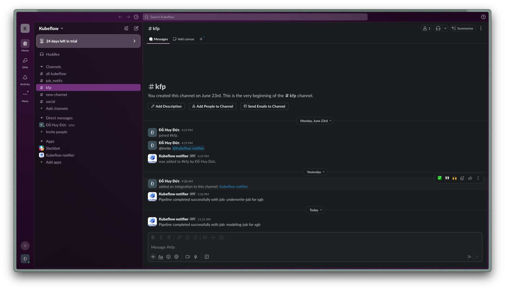


### Kubeflow
Kubeflow is an open-source platform designed to facilitate the deployment, orchestration, and management of machine learning (ML) workflows on Kubernetes. It provides a set of tools and components that enable data scientists and ML engineers to build, train, and deploy ML models at scale.

To install Kubeflow, first you clone the Kubeflow manifest repo [Kubeflow manifest 1.10](https://github.com/kubeflow/manifests/tree/v1.10-branch). I have already cloned this repo in `kubeflow/manifests` folder. In this repo, I install all Kubeflow platform by this command:
```bash
cd kubeflow/manifests
while ! kustomize build example | kubectl apply --server-side --force-conflicts -f -; do echo "Retrying to apply resources"; sleep 20; done
```

#### Expose Kubeflow to the internet
While using GKE cluster, you can use `kubectl port-forward svc/istio-ingressgateway -n istio-system 8080:80` to access the Kubeflow central dashboard but it will only work for your local machine. To expose Kubeflow to the internet, you need to change service Istio ingress gateway from `ClusterIP` -> `Loadbalancer`. The internal service mesh for Kubeflow services is still persists for us to create, delete Notebook, etc.

```bash
k edit svc istio-ingressgateway -n istio-system
```
Navigate to `spec` -> `type` and change it from `ClusterIP` to `LoadBalancer`. After that, you can also set the external traffic policy to `Cluster` to ensure that the traffic is routed to the correct pod. When using kubectl edit, you have to use `vim` to edit the file.

```yaml
spec:
  clusterIP: 34.118.239.5
  clusterIPs:
  - 34.118.239.5
...
  type: ClusterIP #change to LoadBalancer
```

Wait for a few minutes until `istio-ingressgateway` service got `EXTERNAL-IP` address. You can check the status of the service by running the following command:

```bash
k get svc istio-ingressgateway -n istio-system
```

All virtual services in Kubeflow are using Istio service mesh, you cacn check gateway and virtual service which route to `kubeflow-gateway`
```bash
k get virtualservices -A 
```
You need to map `<ISTIO-EXTERNAL-IP>` to your local machine. You can do this by adding the following line to your `/etc/hosts` file:

```bash
sudo nano /etc/hosts

<ISTIO-EXTERNAL_IP> kubeflow.ducdh.com
```
Then you can access Kubeflow central dashboard by going to `http://ducdh.kubeflow.com` in your browser without port-forwarding.
**Using Kubeflow Pipelines Inside Kubeflow Notebook**:
After Kubeflow manifests version v1.7, the default button to allow pipeline to run inside the namespace is removed, we need to add this manually by providing `kubeflow-user-example-com` Service Account and add RBAC role to Pod Default. 

```bash
k apply -f kubeflow/kfp-access/kfp-access.yaml
```
You can also based on this template to add your own configuration button like add GCP credential, Wandb credential, etc. 


I'm also build a custom image for Kubeflow Notebook, this image is based on the official Kubeflow Notebook image but with some additional packages installed. You can find the Dockerfile in `dockerfiles/Dockerfile.kubeflow_notebook`. 

```bash
docker build \
  -t microwave1005/scipy-img:0.1 \
  -t microwave1005/scipy-img:latest \
  -f dockerfiles/Dockerfile.kubeflow_notebook .

docker push microwave1005/scipy-img:0.1
docker push microwave1005/scipy-img:latest
```

#### Ingress controller
I'm using Nginx ingress controller to expose all services in this project to the internet which you can access services by domain name. In this case, I'm setting `proxy-body-size` to `5120G` to allow large file upload to Minio. I'm also set proxy timeout to `600` seconds to allow long running request in `GET` method in Evidently in the `api` for monitoring data drift.
```bash
helm repo add ingress-nginx https://kubernetes.github.io/ingress-nginx

helm install ingress-nginx ingress-nginx/ingress-nginx \
  --namespace ingress-nginx \
  --create-namespace \
  --set controller.service.type=LoadBalancer \
  --set controller.service.externalTrafficPolicy=Cluster \
  --set controller.resources.requests.cpu=100m \
  --set controller.resources.requests.memory=90Mi \
  --set controller.config.proxy-body-size="5120G" \
  --set controller.config.proxy-connect-timeout="600" \
  --set controller.config.proxy-send-timeout="600" \
  --set controller.config.proxy-read-timeout="600"
```

After that, wait for a few minutes until `ingress-nginx-controller` service got `EXTERNAL-IP` address. You can check the status of the service by running the following command:

```bash
k get svc ingress-nginx-controller -n ingress-nginx
```
After Nginx pod got `EXTERNAL-IP`, you need to map this IP to your local machine. You can do this by adding the following lines to your `/etc/hosts` file:
```bash
sudo nano /etc/hosts

<EXTERNAL-IP-NGINX> mlflow.ducdh.com
<EXTERNAL-IP-NGINX> api.ducdh.com
<EXTERNAL-IP-NGINX> minio.ducdh.com
<EXTERNAL-IP-NGINX> console.minio.ducdh.com
<EXTERNAL-IP-NGINX> prometheus.ducdh.com
<EXTERNAL-IP-NGINX> grafana.ducdh.com
<EXTERNAL-IP-NGINX> app.ducdh.com
```

### Minio
Im using Minio helm chart to deploy Minio in this project. You can find the helm chart in `minio` folder which is cloned from this repo [Minio community helm chart](https://github.com/minio/minio/blob/master/helm/minio/README.md)

```bash

helm install minio ./helm-charts/minio \
  --namespace minio \
  --create-namespace \
  --set mode=standalone \
  --set rootUser=minio \
  --set rootPassword=minio123 \
  --set persistence.size=10Gi \
  --set service.type=ClusterIP \
  --set resources.requests.memory=1Gi \
  --set ingress.enabled=true \
  --set ingress.ingressClassName=nginx \
  --set ingress.hosts[0]=minio.ducdh.com \
  --set consoleIngress.enabled=true \
  --set consoleIngress.ingressClassName=nginx \
  --set consoleIngress.hosts[0]=console.minio.ducdh.com 
```

#### Uploading data to Minio
In this project, I'm tracking all data under `sample-data` bucket in Minio for simplicity. For simplicity, in this project, I'm using minio root user and password which is `minio` and `minio123`.

Download data from gdrive using the following command:
```bash
gdown --folder https://drive.google.com/drive/folders/1HCoHY7N0GGCIqFouF3mx9cVKY35Z-p44?usp=drive_link
```

After that, you can push data to Minio using the following command:
```bash

mc alias set localMinio http://minio.ducdh.com minio minio123
mc mb localMinio/sample-data
mc mb localMinio/mlflow

mc cp --recursive ./data localMinio/sample-data
mc ls --recursive localMinio/sample-data
```

### Mlflow 
In this repo, I'm using Mlflow as model registry and tracking experiment. The Mlflow deployment from MLflow community helm chart to deploy MLflow in this project. You can find the helm chart in `mlflow` folder which is cloned from this repo [MLflow community helm chart](https://github.com/community-charts/helm-charts/tree/main/charts/mlflow)

First, we initialize Postgres database for MLflow backend store.
```bash
k create ns mlflow
k apply -f helm-charts/mlflow//postgres/postgres.yaml
```

Then install Mlflow using helm chart
```bash
helm repo add community-charts https://community-charts.github.io/helm-charts

helm install mlflow community-charts/mlflow \
  --namespace mlflow \
  --set ingress.enabled=false \
  -f helm-charts/mlflow/custom-values.yaml

```
I'm using Postgres as backend store and Minio as artifact store. This can be configure using this cmd

```bash
helm upgrade --install mlflow community-charts/mlflow \
  --namespace mlflow \
  --reuse-values \
  \
  --set backendStore.databaseMigration=true \
  --set backendStore.postgres.enabled=true \
  --set backendStore.postgres.host=postgres-service \
  --set backendStore.postgres.port=5432 \
  --set backendStore.postgres.database=postgres \
  --set backendStore.postgres.user=postgres \
  --set backendStore.postgres.password=postgres \
  \
  --set artifactRoot.s3.enabled=true \
  --set artifactRoot.s3.bucket=mlflow \
  --set artifactRoot.s3.awsAccessKeyId=minio \
  --set artifactRoot.s3.awsSecretAccessKey=minio123 \
  \
  --set extraEnvVars.AWS_ACCESS_KEY_ID=minio \
  --set extraEnvVars.AWS_SECRET_ACCESS_KEY=minio123 \
  --set extraEnvVars.AWS_REGION=us-east-1 \
  --set extraEnvVars.MLFLOW_S3_ENDPOINT_URL=http://minio.minio.svc.cluster.local:9000 \
  --set extraEnvVars.MLFLOW_S3_IGNORE_TLS="true" \
  --set extraEnvVars.AWS_S3_ADDRESSING_STYLE="path" \
  \
  --set serviceMonitor.enabled=true \
  \
  -f helm-charts/mlflow/custom-values.yaml \
  --set ingress.enabled=true \
  --set ingress.hosts[0].host=mlflow.ducdh.com \
  --set ingress.hosts[0].paths[0].path=/ \
  --set ingress.hosts[0].paths[0].pathType=Prefix
```

### Prometheus and Grafana
To monitor the system, I'm using Prometheus and Grafana. I'm using Kube-prometheus-stack helm chart to deploy Prometheus and Grafana in this project. You can find the helm chart in `monitor` folder which is cloned from this repo [Kube-prometheus-stack helm chart](https://github.com/prometheus-community/helm-charts/tree/main/charts/kube-prometheus-stack)

```bash
helm repo add prometheus-community https://prometheus-community.github.io/helm-charts

helm install kps prometheus-community/kube-prometheus-stack -n monitoring --create-namespace
```

#### Prometheus
I'm setting up Prometheus to monitor system metric through OpenTelemetry. I already added alert rules in the `helm-charts/monitoring/custom-values.yaml` file. 

#### Grafana
Grafana is a powerful open-source analytics and monitoring solution that integrates with various data sources, including Prometheus. It provides a rich set of features for visualizing and analyzing time-series data. I'm also modified Grafana in `helm-charts/monitoring/custom-values.yaml`.

vid custom otel grafana dashboard


You can also check other Grafana dashboards in [Grafana lab](https://grafana.com/grafana/dashboards/), in this project, I'm using Node Exporter Full dashboard to monitor the all cluster nodes.


```bash
helm upgrade kps prometheus-community/kube-prometheus-stack \
  -n monitoring \
  -f helm-charts/monitoring/custom-values.yaml \
  --set slack.channel="#kfp" \
  --set slack.webhookURL="https://hooks.slack.com/services/xxxxx" \
  --reuse-values
```

### Evidently
In this project, I'm using Evidently to monitor the model performance and data quality. It will be deploy as `LoadBalancer` service in `monitoring` namespace. You can access it by going to `http://<EXTERNAL-IP-EVIDENTLY>:8000/` in your browser. This allow the GET method from the FastAPI endpoint to pull the model performance metrics and data quality metrics from Evidently.


```bash
helm install evidently ./helm-charts/evidently \
  --namespace monitoring \
  --set replicaCount=1 
```

### Jaeger
To trace the request and response in the API endpoint, I'm using Jaeger `all-in-one` deploymen in Jaeger helm chart to deploy Jaeger in this project. You can find the helm chart in `jaeger` folder which is cloned from this repo [Jaeger all-in-one helm chart](https://github.com/jaegertracing/helm-charts/tree/main/charts/jaeger). In my app, I'm manually trace all my POST and GET method.

```bash
helm repo add jaegertracing https://jaegertracing.github.io/helm-charts

helm install jaeger jaegertracing/jaeger \
  --namespace monitoring \
  --values helm-charts/jaeger/custom-values.yaml
```

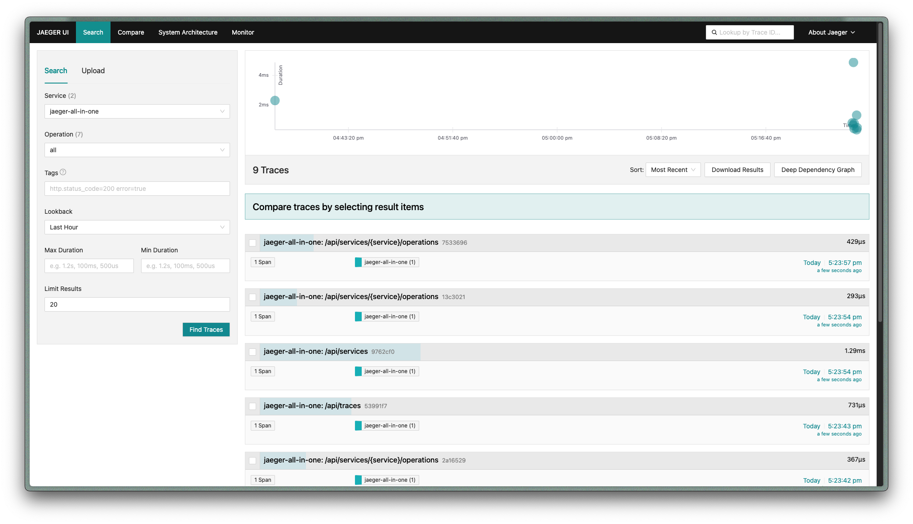

### API Endpoint
In the endpoint API, the application is pulling model from Mlflow artifact storage which is under Minio bucket `mlflow` from Minio deployment in `minio` namespace. The model joblib is stored in `mlpipeline` bucket from Minio under `kubeflow` namespace. This app consist 2 POST method, one is raw prediction which used to predict new customer which is not in the existed database. The 2nd one is predict by id which customer is already existed in the database. I'm also collecting prediction log using OpenTelemetry Instrument and send it back to Prometheus via `service-monitor.yaml` deployment from Prometheus CRD. The metrics dashboard is created in Grafana throguh a configmap that created above. In my api helm chart, I used `microwave1005/prediction-api:latest` as the default image. The other version is also build to revert when necessary. First, due to my api need to use Minio to pull artifact, you need to create a namespace for the API and then create a secret for Minio credentials. 


```bash
k create namespace api

k create secret generic minio-creds \
  --from-literal=access_key=minio \
  --from-literal=secret_key=minio123 \
  -n api
```

Then, you can install the API helm chart with the following command `After model is registered in Mlflow model registry`. Remember to check parent run id in `Mlfow UI` or `Kubeflow downstream artifact` for the API to pull the preprocess joblib and `Evidently External IP` to use GET method. You can check the Evidently External IP by running the following command:
```bash
k get svc evidently-ui -n monitoring
```

This section only create namespace and secret for Minio credentials for API deployment through CICD pipeline, navigate to [Jenkins](#jenkins) to run the pipeline. 

## Kubeflow usage 
### Kserve

In my project, I'm using `FastAPI` instead of Kserve because Kserve is not fully supported with OpenTelemetry [issue](https://github.com/kserve/kserve/issues/2668)

### Using Kubeflow Pipeline
For simplicity, I'm assume that the `Kubeflow pipeline` is both `Production` and `Development` environment. The CICD will run the pipeline recurring in the `Production` environment to retrain the model and update the model in the `Production` environment while the `Development` environment is used for testing and development purpose which pushed from Kubeflow notebook like my other repo [kubeflow-nb](https://github.com/dohuyduc2002/kubeflow-nb).

To run the pipeline, firstly you need to build the `base image` for the pipeline.
```bash
docker build \
  --push \
  -t microwave1005/kfp_run_image:latest \
  -t microwave1005/kfp_run_image:0.1 \
  -f dockerfiles/Dockerfile.kfp_run_image \
  .
docker push microwave1005/kfp_run_image:latest
docker push microwave1005/kfp_run_image:0.1
```

After that, compile the component `with the base image` using `kfp cli` which `overwrite your base image`. This will generate a Dockerfile, and compiled yaml folder `component_metadata` in `src/pipeline/scripts/` folder for you to refer. In this project, I'm using `kfp==2.12.1` install it using `pip`. You can change the base and target image in `src/pipeline/scripts/components_utils.py` file. 

```bash
kfp component build \
  --component-filepattern '*.py' \
  --overwrite-dockerfile \
  --build-image \
  --platform linux/amd64 \
  --push-image \
  src/model_pipeline/scripts/ 
```
Next, compile the pipeline into yaml file
```bash
kfp dsl compile \
  --py src/model_pipeline/pipeline.py \
  --output src/model_pipeline/pipeline.yaml
```
Then, navigate to [Jenkins](#jenkins) to run the Kubeflow pipeline in CICD. 
### Katib
Under implementation

### Config Kubeflow Central Dashboard
Kubeflow Central Dashboard allow users to manage their Kubeflow resources and access various components of the Kubeflow ecosystem. It provides a unified interface for users to interact with different Kubeflow components, such as Pipelines, Katib, Kserve, and more. It can also be used to add others outside components with Configmap through virtual service. 

There is 2 ways to add new components to the dashboard:
1. Internal Link: Run inside Kubeflow central dashboard, require sidecar proxy to Istio
2. External Link: Create a link to external service, no need sidecar proxy to Istio

For simplicity, I'm using external link method the Central Dashboard configmap is already created in `kubeflow/dashboard` folder. In this configmap, I added external link to Mlflow, Minio, Grafana and Jenkins which copy the configmap dashboard to `dashboard-configmap.yaml` file. You can use `kubectl edit configmap centraldashboard-config -n kubeflow` to edit the configmap directly in the cluster with vim.

```bash
k delete configmap centraldashboard-config -n kubeflow
k apply -f kubeflow/dashboard/dashboard-configmap.yaml
k rollout restart deployment centraldashboard -n kubeflow
```

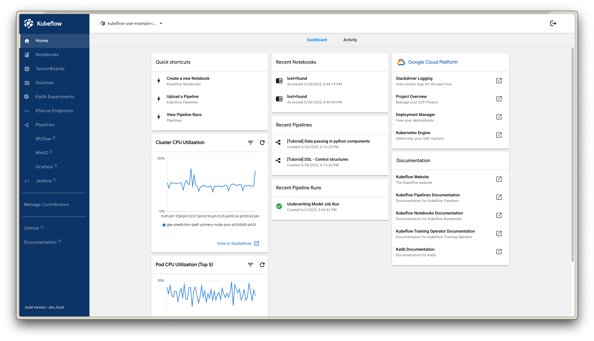

## Setting Azure VM
To allow your local machine to access the Azure VM, you need to generate a key pair. `terraform/azure/main.tf`, I already added my public key to the VM so you can SSH to connect to the VM later once the VM is created.

```bash
ssh-keygen -t rsa -b 4096 -f ~/.ssh/id_rsa
```

Due to Azure does not using default network like GKE, you need to configure NIC, Subnet and VPC manually in the `terraform/azure/main.tf` file. You can refer to the Terrafom Azurerm documentation [Azurerm 4.1.0 docs]('https://registry.terraform.io/providers/hashicorp/azurerm/4.1.0/docs'). To get your Azure subscription ID, login to your Azure account and navigave to `Subscriptions` in the Azure portal. You can find your subscription ID in the `Overview` tab of your subscription. After that, you can run the following command to create the Azure VM for Jenkins:

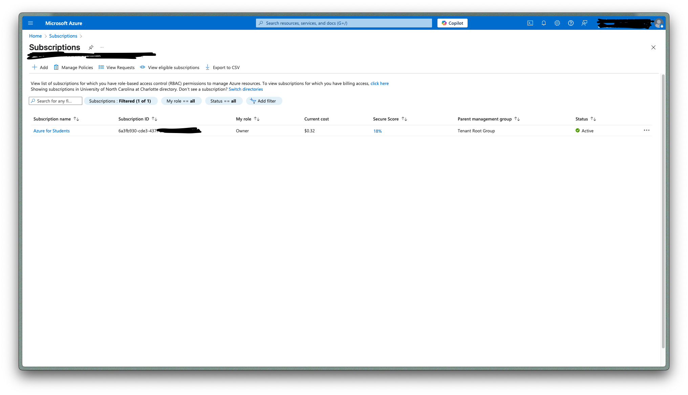

I'm mapping istio and nginx external IP to the VM so you can access Kubeflow, Mlflow, Minio, Grafana and Jenkins from the VM for the cicd pipeline in `cloud-init.yaml` file to install components after the VM is created, be sure to modify `ExternalIP` before creating the VM. 

```yaml
  # CHANGE THIS TO YOUR ISTIO AND NGINX EXTERNAL IP
  - echo "35.192.103.219 kubeflow.ducdh.com" >> /etc/hosts
  - echo "35.239.155.17 minio.ducdh.com" >> /etc/hosts
  - echo "35.239.155.17 mlflow.ducdh.com" >> /etc/hosts

```
After that, create the VM by running the following command in the `terraform/azure` folder:
```bash
terraform apply -var="subscription_id=<YOUR_SUBSCRIPTION_ID>" 
```
After creating the VM, you need to refresh the tf state to retrieve your dynamic public IP, then ssh to the VM using the following command:

```bash
terraform refresh -var="subscription_id=<YOUR_SUBSCRIPTION_ID>" 
``` 
To access the VM, you can use the following command, in this repo, my `<your_admin_usrname>` is `ducdh`

```bash
ssh -i ~/.ssh/id_rsa <your_admin_usrname>@<your_vm_public_ip>
```

After wait a few minitues for VM to install docker, check the container status by running the following command and wait for the log `cloud-init` to finish installing all components in the VM. 

```bash
sudo cat /var/log/cloud-init-output.log
```

### ELK Stack
I'm installing the ELK stack with docker-compose and open port in `main.tf` to allow access to ELK stack and GKE cluster, I have forked and modified the ELK stack docker-compose repo here [ELK Stack docker-compose](https://github.com/dohuyduc2002/docker-elk). After the ELK stack is running, install `Filebeat Daemonset` in `kube-system` namespace to collect logs from all pods in the cluster. You can find the Filebeat Daemonset in `filebeat/filebeat-kubernetes.yaml` file where it from the official filebeat deployment [Filebeat Kubernetes](https://github.com/elastic/beats/blob/v9.0.1/deploy/kubernetes/filebeat-kubernetes.yaml). **I have modify the filebeat-kubernetes.yaml file to ship log to logstash port in AzureVM.** 

```yaml
    output.logstash:
      hosts: ["40.78.159.74:5044"]  # CHANGE THIS TO YOUR AZURE VM PUBLIC IP FILEBEAT PORT
```

```bash
k apply -f filebeat/filebeat-kubernetes.yaml
```

The log will be shipped to the ELK stack in Azure VM through Logstash. You can access the ELK stack by going to `http://<your_vm_public_ip>:5601` in your browser. The Kibana dashboard will allow you to visualize and analyze the logs collected from the cluster.

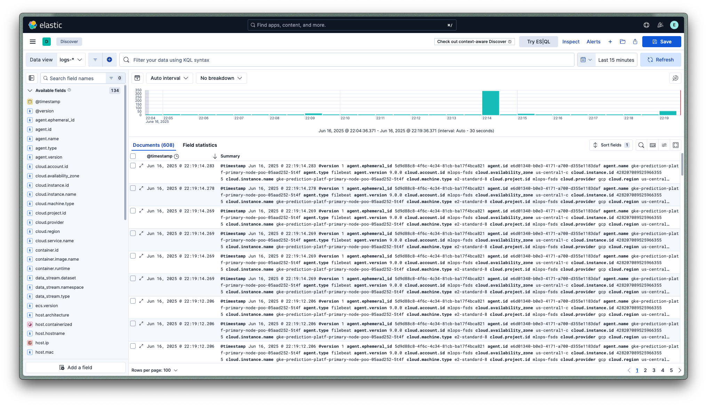
### Jenkins
Firstly, my CICD pipeline is using custom Jenkins image which is built from `dockerfiles/Dockerfile.custom_jenkins` file. This image is used to run Jenkins pipeline and build Docker images for the project. Also, the stage `test` and `promote` in jenkins is using `dockerfiles/Dockerfile.kfp_jenkins_ci` to run other stages and `dockerfiles/Dockerfile.jenkins_agent` to run the agent in GKE cluster from Azure VM. 

```bash
docker build \
  -t microwave1005/kfp-jenkins-ci:latest \
  -t microwave1005/kfp-jenkins-ci:0.1 \
  -f dockerfiles/Dockerfile.kfp_jenkins_ci .

docker push microwave1005/kfp-jenkins-ci:latest
docker push microwave1005/kfp-jenkins-ci:0.1
```

```bash
docker build \
  -t microwave1005/custom-jenkins:latest \
  -t microwave1005/custom-jenkins:0.1 \
  -f dockerfiles/Dockerfile.custom_jenkins .

docker push microwave1005/custom-jenkins:latest
docker push microwave1005/custom-jenkins:0.1
```

```bash
docker build \
  -t microwave1005/kfp-jenkins-agent:latest \
  -t microwave1005/kfp-jenkins-agent:0.1 \
  -f dockerfiles/Dockerfile.jenkins_agent .

docker push microwave1005/kfp-jenkins-agent:latest
docker push microwave1005/kfp-jenkins-agent:0.1
```
My CICD pipeline flow consists in unittesting my components running on KFP. If the test fail the coverage, the pipeline is stopped. After testing stage complete, we create a new recurring run based on previous one-off `run_id`, `pipeline_name` and `version_name` then build Dockerfile for the app along with model promotion to `stagging`. I'm also cloned previous [kubeflow notebook repo](https://github.com/dohuyduc2002/kubeflow-nb) and rename it as `kubeflow_nb` in the `src` folder. I have already clone it and remove `.git` folder using `rm -rf .git` command. This is to ensure that the Kubeflow notebook can access the git repository and push the code to the repository. This will be used to run test in the CICD pipeline.

#### Access Jenkins 
I already open port 8080 for Jenkins in Azure VM, so you can access Jenkins by going to `http://<your_vm_public_ip>:8080` in your browser. To get the initial admin password, you can run the following command:

```bash
docker exec -it jenkins cat /var/jenkins_home/secrets/initialAdminPassword
```
And then login to Jenkins to install `Reccomended plugins` and login with the admin user.

#### Configuring Jenkins
a. Adding webhook to Github
We adding webhook to Github to trigger Jenkins pipeline when there is a new commit to the repository. You can add webhook by going to your GitHub repository settings and then click on `Webhooks` and then click on `Add webhook`. In the `Payload URL` field, you can enter the following URL:

```
http://<your_vm_public_ip>:8080/github-webhook/
```

b. Install Jenkins plugins
To allow my CICD pipeline to build docker, using helm upgrade in gke cluster, you need to install these plugins too:
- Docker
- Docker Commons
- Docker Pipeline
- Docker API
- Kubenetes
- Kubernetes Client API
- Kubernetes CLI
- Google Kubernetes Engine

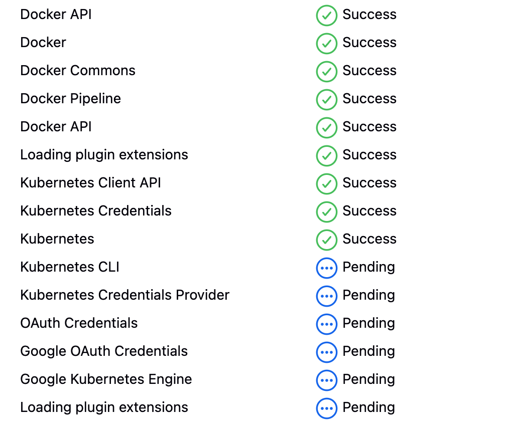

c. Adding GKE credentials
First, you have to prepare your Service account json, in the [Create GCP service account](#create-gcp-service-account) I have already created it, you can also use this credential. After that, go to `Mange Jenkins/Cloud` to add new cloud with `Kubernetes`, to add new Cloud to Jenkins. There is 2 field named `Kubenertes IP` and `Certificate`, you have to go to your console in GKE to get that.

vid...

This will only allow Jenkins controller which is on Azure VM to access GKE cluster, the following step will guide you to add GCP service account key to allow Jenkins agent to `helm upgrade` or `kubectl` commands to GKE cluster. Due to the VM is running outside GCP, you have to add GCP SA key to the namespace that Jenkins agent is running in to authenticate to GKE cluster. [Refer to this guide](https://cloud.google.com/kubernetes-engine/docs/how-to/api-server-authentication#applications_in_other_environments). In the Jenkinsfile, I have created an inline yaml script to configure the Jenkins agent to use the GCP service account key to authenticate to GKE cluster. This is done by creating a Kubernetes secret in the `api` namespace 

```bash
k create secret generic gcp-key \
  --from-file=gcp-key.json=gcp-key.json \
  -n api
```

d. Adding Dockerhub, Github, Minio and Kubeflow credentials
We will add these credentials to Jenkins with `username with password`. For Dockerhub, Github, you need to create your secret key, you can following this video. For Minio, Kubeflow, since we already have these creadentials in the initial setup we add it alongside with Dockerhub and Github.

vid ...

e. Testing cicd
My cicd pipeline consist of 9 stages:
- Unit test: This stage will run the unit tests for the project, if the tests fail, the pipeline will stop.
- Schedule recurring run: This stage will schedule a recurring run for the pipeline with the latest commit hash and the latest version of the pipeline.
- Build Docker image: This stage will build the Docker image for the project and push it to Dockerhub.
- Promote model to stagging: This stage will promote the model to the `stagging` tag in Mlflow model registry.
- Approve model: This stage will wait for the manual approval to promote the model to the `production` tag in Mlflow model registry.
- Promote model to production: This stage will promote the model to the `production` tag in Mlflow model registry.
- Deploy model: This stage will deploy the model to the GKE cluster using Helm upgrade.

After pipeline completed or failed, I have a cleanup stage to clean up docker images to save space

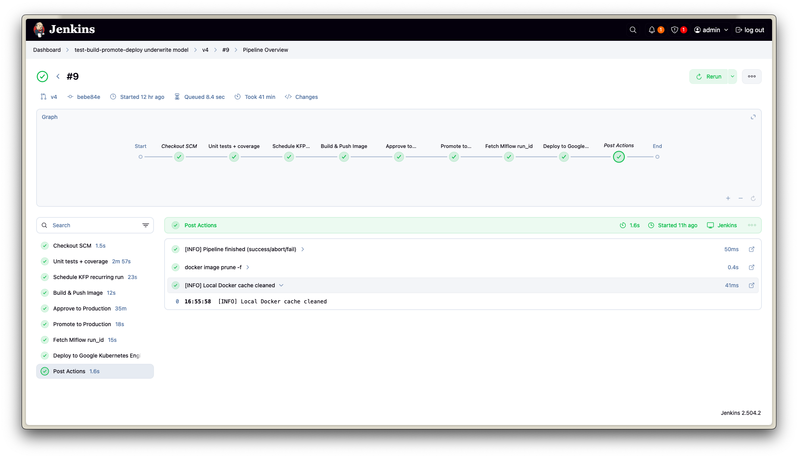


