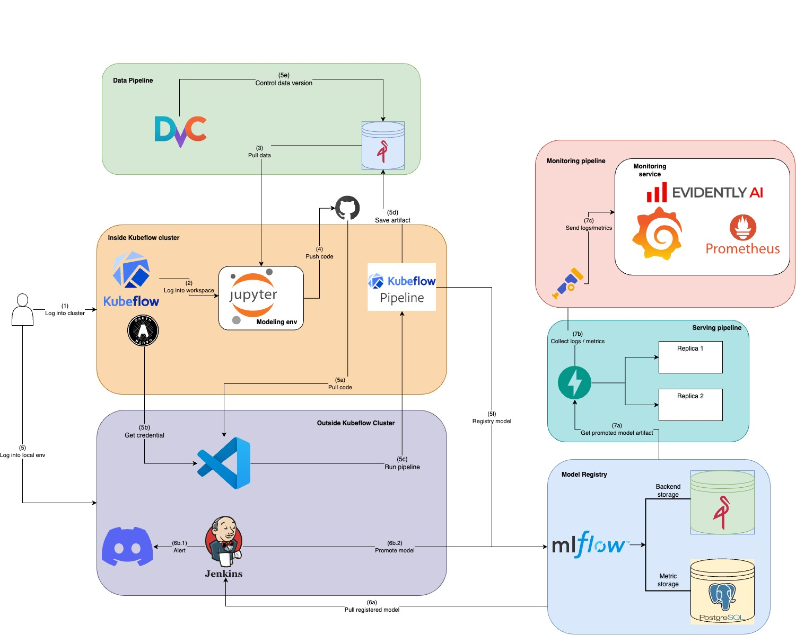
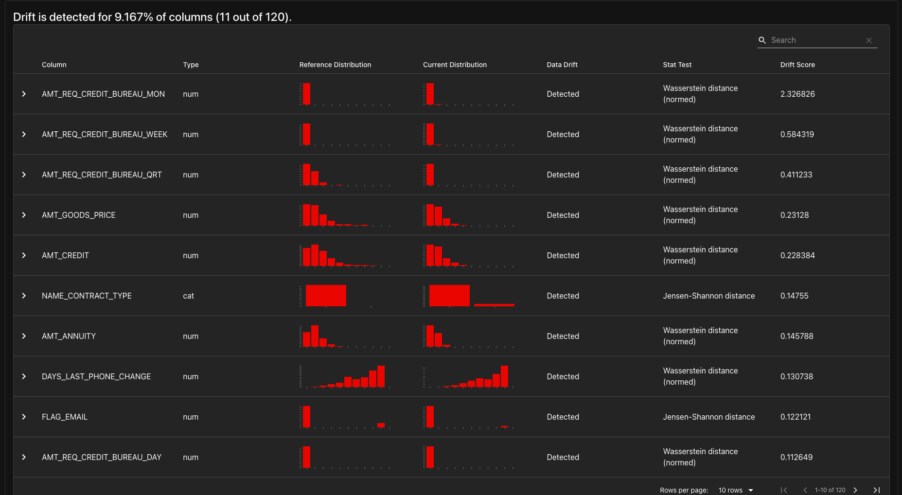

# An unified platform for Credit modeling

* Contents:
  * [Introduction](#introduction)
  * [Repository structure](#repository-structure)
  * [Repository structure](#repository-structure)
  * [Setting up GCP](#setting-up-gcp)
  * [Prerequisites installation](#prerequisites-installation)
  * [Component Preparation](#component-preparation)
  * [Usage](#usage)
  * [CICD pipeline](#cicd-pipeline)

**Disclaimer**: This is a version 1.2 of this project, I will keep updating this project to make it more complete and useful.


## Introduction
This project is an unified platform for Datasciene team whom working on Credit modeling sector. This repo will help and guide you to build and serve ML model as in a production environment (Google Cloud Platform and Azure). I also used tool & technologies to quickly deploy the ML system into production and automate processes during the development and deployment of the ML system.

## Repository structure
```txt
Root
├── dockerfiles                         *  All Dockerfiles for the project
├── helm-charts                         *  Helm charts for deploying components in this project            
│   ├── api                             *  Custom Helm chart for the API component                  
│   ├── jenkins                         *  Custom Helm chart for Jenkins
│   ├── minio                           *  Custom Helm chart values for MinIO
│   ├── mlflow                          *  Custom Helm chart values for MLflow
│   └── monitoring                      *  Custom Helm chart values for Prometheus and Grafana
├── Jenkinsfile                         *  Jenkins pipeline file for CI/CD
├── kubeflow                            *  Kubeflow deployment files
│   ├── dashboard                       *  Custom Kubeflow Central Dashboard
│   ├── kfp-access                      *  Custom Kubeflow Pipelines access in Notebook
│   ├── kind.yaml
│   ├── manifests                       *  Kubeflow manifests v1.10
│   ├── notebook                        *  Custom Kubeflow Notebook 
│   ├── patch_vs.sh                     *  Script to patch the Kubeflow virtualservice and gateway
│   ├── README.md
│   └── svc_mesh                        *  Istio service mesh to export Kubeflow services
├── LICENSE
├── media                               *  Media files for the project                      
├── README.md
├── src                                 *  Source code for the project
│   ├── client                          *  Client code for the project
│   ├── kfp_outside                     *  Code for running Kubeflow pipelines outside of the Kubeflow cluster
│   └── ui                              *  UI code for the project
├── terraform                           *  Terraform files for deploying the project
│   ├── gce                             *  Deploying Jenkins in GCE 
│   └── gke                             *  Deploying the project in GKE
├── tests                               *  Testing files for the project
├── Jenkinsfile                         *  Jenkins pipeline file for CI/CD
└── pytest.ini                                             
```
## To-Do
- [ ] Optimize GKE usage to fit GCP quota for all services instead of using Azure VM
- [ ] Implement Data Ingestion, Data Quality check, Data Lake, Data Warehouse, and Data Pipeline
- [ ] Implement Cloud Build for CI/CD
- [ ] Code refactoring and deduplication
- [ ] Add integration test 
- [ ] Add media files 

## Setting up GCP
1. Create a Google Cloud account and set up billing.
After creating GCP account, create a new project and enable billing for it. You can follow the official [GCP account registration guide](https://cloud.google.com/free/docs/free-cloud-features) to create a GCP account and set up billing.


Next, navigate to [Compute Engine API UI](https://console.cloud.google.com/marketplace/product/google/compute.googleapis.com) to "ENABLE" Compute Engine API:

Navigate to [Kubernetes Engine API UI](https://console.cloud.google.com/marketplace/product/google/container.googleapis.com) to "ENABLE" Kubernetes Engine API:

Navigate to [Cloud Builder API UI](https://console.cloud.google.com/marketplace/product/google/cloudbuild.googleapis.com) to "ENABLE" Cloud Build API:

2. Instal gcloud cli
Because this project is running on GKE, you need to install gcloud cli to manage GCP resources. You can follow the official [Gcloud installation guide](https://cloud.google.com/sdk/docs/install) 

3. Create GCP service account
To enable usage of GCP resources, you need to create a service account and assign it the necessary roles. You can follow the official [GCP service account](https://console.cloud.google.com/iam-admin/serviceaccounts) to create a service account and assign it the necessary roles. After that, save it as a json file into `terraform/gce` and `terraform/gke` folder.

## Prerequisites installation
This is the environment I used to run this project:
- Client Version: v1.32.3
- Kustomize Version: v5.5.0
- Server Version: v1.32.0

1. Install Kubernetes

Since Kubernetes is written in Golang, you need to install Golang first. You can follow the official [Golang installation guide](https://golang.org/doc/install) or run the following commands:

```bash
sudo apt update
sudo apt install -y golang-go
```

Be sure to check Kustomize version cause this will be used to deploy Kubeflow. 

```bash
curl -Lo kustomize.tar.gz https://github.com/kubernetes-sigs/kustomize/releases/download/kustomize%2Fv5.5.0/kustomize_v5.5.0_linux_amd64.tar.gz
tar -xzf kustomize.tar.gz
chmod +x kustomize
sudo mv kustomize /usr/local/bin/
```

Install Krew for Kubectl plugins, you can install Krew by following this link: [Krew installation](https://krew.sigs.k8s.io/docs/user-guide/setup/install/)

For convinience when using Kubeflow, you can install these Kubectl plugins and alias:
```bash
echo "alias k=kubectl" >> ~/.bashrc
source ~/.bashrc
kubectl krew install ctx
kubectl krew install ns
echo "alias kubectx='kubectl ctx'" >> ~/.bashrc
echo "alias kubens='kubectl ns'" >> ~/.bashrc
```

2. Install Terraform

Terraform is an open-source infrastructure as code (IaC) tool that allows you to define and provision infrastructure using a declarative configuration language. It enables you to manage cloud resources, such as virtual machines, networks, and storage, in a consistent and repeatable manner. You can follow the official [Terraform installation guide](https://learn.hashicorp.com/tutorials/terraform/install-cli) to install Terraform.

### GCP deployment
1. Create a GCP project and enable the following APIs:
   - Kubernetes Engine API
   - Compute Engine API
2. Create GKE cluster using Terraform as IaC

```bash
cd terraform/gke

terraform init
terraform plan
terraform apply
```
The output from `outputs.tf` file will show you GKE cluster name, endpoint and project id. For this project, I'm using e2-standard-8 with 1 node which will be a back-end nodes and a routing node. 
I'm using default VPC network provided by GKE cluster when creating the cluster. If you prefer to use your own VPC to issue own IP address range, you can modify the `main.tf` 

3. Switch context to GKE cluster 
```bash

gcloud container clusters get-credentials <cluster-name> --zone <zone> --project <project-id>
```
after this, you can use `kubectx` to switch context to GKE cluster.

That all the infrastucture you need to install. 

## Component Preparation
In this section, I will guide you to install and configure all the components in this project.
### Initialize Kubeflow cluster
Kubeflow is an open-source platform designed to facilitate the deployment, orchestration, and management of machine learning (ML) workflows on Kubernetes. It provides a set of tools and components that enable data scientists and ML engineers to build, train, and deploy ML models at scale.

To install Kubeflow, first you clone the Kubeflow manifest repo [Kubeflow manifest 1.10](https://github.com/kubeflow/manifests/tree/v1.10-branch). I have already cloned this repo in `kubeflow/manifests` folder. 

After that, you can install Kubeflow using the README file in `kubeflow/manifests` folder. 

### Expose Kubeflow to the internet
While using GKE cluster, you can use `kubectl port-forward svc/istio-ingressgateway -n istio-system 8080:80` to access the Kubeflow central dashboard but it will only work for your local machine. To expose Kubeflow to the internet, you need to create a LoadBalancer service for Istio ingress gateway.

1. Create Istio LoadBalancer service inside `istio-system` namespace
Because we need to keep internal service mesh for Kubeflow services, the new Istio LoadBalancer service will take external IP from GKE cluster and route all traffic to the internal Istio ClusterIP service mesh. 

** Note** : In my case, I have to create a new istio `LoadBalancer` service instead of change the default istio from `ClusterIP` -> `Loadbalancer` to expose Kubeflow to the internet because I don't have TLS certificate for the default Istio LoadBalancer service which is used to create, delete Notebook. You can still can use all Kubeflow services with the new istio LoadBalancer service.

```bash
cd kubeflow/svc_mesh
k apply -f istio-ingressgateway-lb.yaml
```
Wait for a few minutes until `istio-ingressgateway-lb` service got `EXTERNAL-IP` address. You can check the status of the service by running the following command:

```bash
k get svc istio-ingressgateway-lb -n istio-system
```

2. To ensure that service mesh is working inside the cluster, you have to patch all virtual services in Kubeflow to use the new Istio LoadBalancer service. For more information, check `kubeflow/patch_vs.sh` file
```bash 
bash patch_vs.sh
```
This command will patch all virtual services with new Istio LoadBalancer gateway and host.

```bash
k get virtualservices -A 
```
After all virtual services are patched, you may need to map `<ISTIO-EXTERNAL-IP>` to your local machine. You can do this by adding the following line to your `/etc/hosts` file:

```bash
sudo nano /etc/hosts

<ISTIO-EXTERNAL_IP> kubeflow.ducdh.com
```
Then you can access Kubeflow central dashboard by going to `http://ducdh.kubeflow.com` in your browser without port-forwarding.
**Using Kubeflow Pipelines Inside Kubeflow Notebook**:
After Kubeflow manifests version v1.7, the default button to allow pipeline to run inside the namespace is removed, we need to add this manually by providing `kubeflow-user-example-com` Service Account and add RBAC role to Pod Default. 

```bash
cd kubeflow/kfp-access
k apply -f kfp-access.yaml
```
You can also based on this template to add your own configuration button like add GCP credential, Wandb credential, etc. 



### Ingress controller for all services
While using GKE cluster, you can not use `kubectl port-forward` to access the services. To expose all services to the internet, you need to install NginX ingress controller and create ingress for each service. Kubeflow is already exposed in previous step.

```bash
helm repo add ingress-nginx https://kubernetes.github.io/ingress-nginx

helm install ingress-nginx ingress-nginx/ingress-nginx \
  --namespace ingress-nginx \
  --create-namespace \
  --set controller.service.type=LoadBalancer \
  --set controller.service.externalTrafficPolicy=Cluster
  --set controller.resources.requests.cpu=100m \
  --set controller.resources.requests.memory=90Mi
  --set controller.config.client-max-body-size=5T \
  --set controller.config.proxy-connect-timeout="600" \
  --set controller.config.proxy-send-timeout="600" \
  --set controller.config.proxy-read-timeout="600" \
  --set controller.config.send-timeout="600" 
```

After that, wait for a few minutes until `ingress-nginx-controller` service got `EXTERNAL-IP` address. You can check the status of the service by running the following command:

```bash
k get svc ingress-nginx-controller -n ingress-nginx
```

### Initialize Minio
Im using Minio helm chart to deploy Minio in this project. You can find the helm chart in `minio` folder which is cloned from this repo [Minio community helm chart](https://github.com/minio/minio/blob/master/helm/minio/README.md)

```bash
helm repo add minio https://charts.min.io/ 

helm install minio minio/minio \
  --namespace minio \
  --create-namespace \
  --set mode=standalone \
  --set rootUser=minio \
  --set rootPassword=minio123 \
  --set persistence.size=10Gi \
  --set service.type=ClusterIP \
  --set resources.requests.memory=2Gi \
  --set ingress.enabled=true \
  --set ingress.ingressClassName=nginx \
  --set ingress.hosts[0]=minio.ducdh.com \
  --set consoleIngress.enabled=true \
  --set consoleIngress.ingressClassName=nginx \
  --set consoleIngress.hosts[0]=console.minio.ducdh.com

```

### Uploading data to Minio
In this project, I'm tracking all data under `sample-data` bucket in Minio for simplicity. For simplicity, in this project, I'm using minio root user and password which is `minio` and `minio123`.

1. Download data from gdrive using the following command:
```bash
gdown --folder https://drive.google.com/drive/folders/1HCoHY7N0GGCIqFouF3mx9cVKY35Z-p44?usp=drive_link
```

2. After that, you can push data to Minio using the following command:
```bash
k port-forward svc/minio 9000:9000 -n minio

mc alias set localMinio http://localhost:9000 minio minio123
mc mb localMinio/sample-data
mc mb localMinio/mlflow

mc cp --recursive ./data localMinio/sample-data

echo "Check data in Minio"
mc ls --recursive localMinio/sample-data

```
### Initialize Mlflow 
MLflow is an open-source platform designed to manage the end-to-end machine learning lifecycle. It provides tools for tracking experiments, packaging code into reproducible runs, and sharing and deploying models.

Im using MLflow community helm chart to deploy MLflow in this project. You can find the helm chart in `mlflow` folder which is cloned from this repo [MLflow community helm chart](https://github.com/community-charts/helm-charts/tree/main/charts/mlflow)

1. We initialize Postgres database for MLflow backend store.
```bash
cd helm-charts/mlflow
k create ns mlflow
k apply -f helm-charts/mlflow/postgres.yaml
```

2. Then install Mlflow using helm chart
```bash
helm repo add community-charts https://community-charts.github.io/helm-charts

helm install mlflow community-charts/mlflow \
  --namespace mlflow \
  --set ingress.enabled=false \
  -f helm-charts/mlflow/custom-values.yaml

```
I'm using Postgres as backend store and Minio as artifact store. This can be configure using this cmd

```bash
helm upgrade --install mlflow community-charts/mlflow \
  --namespace mlflow \
  --reuse-values \
  \
  --set backendStore.databaseMigration=true \
  --set backendStore.postgres.enabled=true \
  --set backendStore.postgres.host=postgres-service \
  --set backendStore.postgres.port=5432 \
  --set backendStore.postgres.database=postgres \
  --set backendStore.postgres.user=postgres \
  --set backendStore.postgres.password=postgres \
  \
  --set artifactRoot.s3.enabled=true \
  --set artifactRoot.s3.bucket=mlflow \
  --set artifactRoot.s3.awsAccessKeyId=minio \
  --set artifactRoot.s3.awsSecretAccessKey=minio123 \
  \
  --set extraEnvVars.AWS_ACCESS_KEY_ID=minio \
  --set extraEnvVars.AWS_SECRET_ACCESS_KEY=minio123 \
  --set extraEnvVars.AWS_REGION=us-east-1 \
  --set extraEnvVars.MLFLOW_S3_ENDPOINT_URL=http://minio.minio.svc.cluster.local:9000 \
  --set extraEnvVars.MLFLOW_S3_IGNORE_TLS="true" \
  --set extraEnvVars.AWS_S3_ADDRESSING_STYLE="path" \
  \
  --set serviceMonitor.enabled=true
```

3. Ingress mlflow service
```bash
helm upgrade --install mlflow community-charts/mlflow \
  --namespace mlflow \
  --reuse-values \
  -f helm-charts/mlflow/custom-values.yaml \
  --set ingress.enabled=true \
  --set ingress.hosts[0].host=mlflow.ducdh.com \
  --set ingress.hosts[0].paths[0].path=/ \
  --set ingress.hosts[0].paths[0].pathType=Prefix

```

### Initialize Prometheus-Grafana
To monitor the system, I'm using Prometheus and Grafana. Prometheus is an open-source systems monitoring and alerting toolkit originally built at SoundCloud. Grafana is an open-source platform for monitoring and observability. I'm using Kube-prometheus-stack helm chart to deploy Prometheus and Grafana in this project. You can find the helm chart in `monitor` folder which is cloned from this repo [Kube-prometheus-stack helm chart](https://github.com/prometheus-community/helm-charts/tree/main/charts/kube-prometheus-stack)

```bash
helm repo add prometheus-community https://prometheus-community.github.io/helm-charts

helm install kps prometheus-community/kube-prometheus-stack -n monitoring --create-namespace
```

#### Prometheus
I'm setting up Prometheus to monitor system metric through OpenTelemetry. I already added alert rules in the `helm-charts/monitoring/custom-values.yaml` file. 

#### Grafana
Grafana is a powerful open-source analytics and monitoring solution that integrates with various data sources, including Prometheus. It provides a rich set of features for visualizing and analyzing time-series data. I'm also modified Grafana in `helm-charts/monitoring/custom-values.yaml`.

vid custom otel grafana dashboard

[Custom Grafana dashboard](media/graf_predict.png)


You can also check other Grafana dashboards in [Grafana lab](https://grafana.com/grafana/dashboards/), in this project, I'm using Node Exporter Full dashboard to monitor the all cluster nodes.

[Grafana Node Exporter Full dashboard](media/graf_node.png)

```bash
helm upgrade kps prometheus-community/kube-prometheus-stack \
  -n monitoring \
  -f helm-charts/monitoring/custom-values.yaml \
  --reuse-values
```
#### Install Evidently model monitoring metrics
```bash
helm install evidently ./helm-charts/evidently \
  --namespace monitoring \
  --set replicaCount=1 
```
In this project, I'm using Evidently to monitor the model performance and data quality. It will be deploy as `LoadBalancer` service in `monitoring` namespace. You can access it by going to `http://<EXTERNAL-IP-EVIDENTLY>:8000/` in your browser. This allow the GET method from the FastAPI endpoint to pull the model performance metrics and data quality metrics from Evidently.


### Serve model with FastAPI and collect log 
In the endpoint API, the application is pulling model from Mlflow artifact storage which is under Minio bucket `mlflow` from Minio deployment in `minio` namespace. The model joblib is stored in `mlpieline` bucket from Minio under `kubeflow` namespace. This app consist 2 POST method, one is raw prediction which used to predict new customer which is not in the existed database. The 2nd one is predict by id which customer is already existed in the database. 

I'm also collecting prediction log using OpenTelemetry and send it back to Prometheus. The metrics dashboard is created in Grafana throguh a configmap that created above .

There are 2 ways to deploy endpoint api
1. Manual: You can deploy the endpoint manually by using the following command:
2. CICD : The endpoint is automatically deployed when the Jenkins pipeline run success 

In this section, we will use the manual way to deploy the endpoint API. 

**You have to build docker image for the endpoint API first which is `dockerfiles/Dockerfile.app`** 
```bash
docker build --no-cache \
  -t microwave1005/prediction-api:v0.1 \
  -f dockerfiles/Dockerfile.app \
  --build-arg MODEL_NAME=xgb_underwrite \
  --build-arg MODEL_TYPE=xgb \
  .

docker push microwave1005/prediction-api:v0.1
```
In case your machine is using ARM architecture (eg Mac m1,...), you can build image like this 
```bash
docker buildx build \
  --platform linux/amd64 \
  -t microwave1005/prediction-api:latest \
  -t microwave1005/prediction-api:v0.1 \
  -f dockerfiles/Dockerfile.app \
  --build-arg MODEL_NAME=xgb_underwrite \
  --build-arg MODEL_TYPE=xgb \
  .

```

In my api helm chart, I used `microwave1005/prediction-api:latest` as the default image. The other version is also build to revert when necessary.

First, due to my api need to use Minio to pull artetfact, you need to create a namespace for the API and then create a secret for Minio credentials. 

```bash
k create namespace api

k create secret generic minio-creds \
  --from-literal=access_key=minio \
  --from-literal=secret_key=minio123 \
  -n api
```

Then, you can install the API helm chart with the following command `After model is registered in Mlflow model registry`
** Note: Remember to check parent run id in Mlfow UI or kubeflow downstream artifact and Evidently ExternalIP to use GET method. 
First you have to check the Evidently External IP by running the following command:
```bash
k get svc evidently -n monitoring
```

Then you can install the API helm chart
```bash
helm install api ./helm-charts/api \
  --namespace api \
  --set version=v0.1 \
  --set monitoring.enabled=true \
  --set image.tag=v0.1 \
  --set replicaCount=1 \
  --set env.PARENT_RUN_ID=916178d5b2c34f1b86d0752ecf6ee6c8 \
  --set env.EVIDENTLY_WORKSPACE=http://35.202.139.205:8000/ \
  --set ingress.enabled=true \
  --set ingress.rules[0].host=api.ducdh.com \
  --set ingress.rules[0].paths[0].path="/" \
  --set ingress.rules[0].paths[0].pathType=Prefix \
  --set ingress.rules[0].paths[0].serviceName=prediction-api \
  --set ingress.rules[0].paths[0].servicePort=8000

```

### Mapping domain name to external IP
This step is optional, but it will help you to access the services easily without using IP address. You can use any domain name that you own, in this project, I'm using `ducdh.com` domain name. Previously, I have already mapped the Istio external IP to `kubeflow.ducdh.com` in the `/etc/hosts` file.
```bash
sudo nano /etc/hosts

<EXTERNAL-IP-NGINX> mlflow.ducdh.com
<EXTERNAL-IP-NGINX> api.ducdh.com
<EXTERNAL-IP-NGINX> minio.ducdh.com
<EXTERNAL-IP-NGINX> console.minio.ducdh.com
<EXTERNAL-IP-NGINX> prometheus.ducdh.com
<EXTERNAL-IP-NGINX> grafana.ducdh.com
```

## Usage 

### Using Kubeflow 
For simplicity, in this project I used default Kubeflow namespace which is `kubeflow-user-example-com`.

After that, you can follow tutorial in this git repo [git-underwrite-mlflow](https://github.com/dohuyduc2002/git-underwrite-mlflow) to setup kubeflow workspace from the UI and git. 

### Using Kserve

In my project, I'm using `FastAPI` instead of Kserve because Kserve is not fully supported with OpenTelemetry. 
[issue](https://github.com/kserve/kserve/issues/2668)

### Using Kubeflow Pipeline
**Kubeflow Pipelines** is a powerful platform for building and deploying scalable and reproducible machine learning (ML) workflows based on Kubernetes. It allows data scientists and ML engineers to define workflows as a series of components, each performing a specific task (e.g., preprocessing, training, evaluation).

With Kubeflow Pipelines, you can:
- Track experiments and compare results visually.
- Automate the ML lifecycle from data ingestion to model deployment.
- Reuse pipeline components across projects.
- Scale easily using Kubernetes-native resources.

Ideal for teams working on MLOps, Kubeflow Pipelines simplifies the path from prototype to production.


### Using Katib
Under implementation

#### Using Kubeflow Pipeline outside the cluster
To ensure the compliance from real world practice, we do not run KFP outside the cluster. This to ensure RBAC and Service account for each associated user. However, we need to access this outside the cluster for the CICD run.

#### Using Kubeflow Pipeline inside the cluster
You can refer to this github repo that I pushed in Kubeflow notebook in this link : [kubeflow-nb](https://github.com/dohuyduc2002/kubeflow-nb), there also documentation in here to setup git and basic usage of Kubeflow notebook workspace. 

### Config Kubeflow Central Dashboard
Kubeflow Central Dashboard allow users to manage their Kubeflow resources and access various components of the Kubeflow ecosystem. It provides a unified interface for users to interact with different Kubeflow components, such as Pipelines, Katib, Kserve, and more. It can also be used to add others outside components with Configmap through virtual service. 

There is 2 ways to add new components to the dashboard:
1. Internal Link: Run inside Kubeflow central dashboard, require sidecar proxy to Istio
2. External Link: Create a link to external service, no need sidecar proxy to Istio

For simplicity, I'm using external link method the Central Dashboard configmap is already created in `kubeflow/dashboard` folder. In this configmap, I added external link to Mlflow, Minio, Grafana and Jenkins. You can also use vim or nano to edit the `dashboard-configmap.yaml` file to add your own components.

```bash
cd kubeflow/dashboard
k delete configmap centraldashboard-config -n kubeflow
k apply -f dashboard-configmap.yaml
k rollout restart deployment centraldashboard -n kubeflow
```

[Dashboard configmap](media/dashboard.png)

## CICD pipeline 
My CICD pipeline flow consists in unittesting my components running on KFP. If the test fail the coverage, the pipeline is stopped. After testing stage complete, we create a new recurring run based on previous one-off `run_id`, `pipeline_name` and `version_name` then build Dockerfile for the app along with model promotion to `stagging`. 

When the build process is complete, there is a mannuall approval in Jenkins to promote the model into the `production` tag, if approved, we retrieve the Mlflow run_id to get artifact for `transformer.joblib` which contain preprocessing step and parse it to helm argument to upgrade to model pod via `api` namespace.
### Jenkins Azure VM
1. Initialize Jenkins 
Firstly, my CICD pipeline is using custom Jenkins image which is built from `dockerfiles/Dockerfile.custom_jenkins` file. This image is used to run Jenkins pipeline and build Docker images for the project. Also, the stage `test` and `promote` in jenkins is using `dockerfiles/Dockerfile.kfp_jenkins_ci` to run 

```bash
docker build -t microwave1005/custom-jenkins:latest -f dockerfiles/Dockerfile.custom_jenkins .
docker build -t microwave1005/kfp-jenkins-ci:latest -f dockerfiles/Dockerfile.kfp_jenkins_ci .

docker push microwave1005/kfp-jenkins-ci:latest
docker push microwave1005/custom-jenkins:latest
```

Then, you can run the Jenkins container with the following command:

2. Generate key pair 
To allow your local machine to access the Azure VM, you need to generate a key pair. `terraform/azure/main.tf`, I already added my public key to the VM so you can SSH to connect to the VM later once the VM is created.

```bash
ssh-keygen -t rsa -b 4096 -f ~/.ssh/id_rsa
```

2. Init Azure VM for Jenkins
Due to Azure does not using default network like GCP, you need to configure NIC, Subnet and VPC manually in the `terraform/azure/main.tf` file. You can refer to the Terrafom Azurerm documentation [Azurerm 4.1.0 docs]('https://registry.terraform.io/providers/hashicorp/azurerm/4.1.0/docs')

To get your Azure subscription ID, login to your Azure account and navigave to `Subscriptions` in the Azure portal. You can find your subscription ID in the `Overview` tab of your subscription.
After that, you can run the following command to create the Azure VM for Jenkins:

[Azure subscription ID](media/azure_subcription.png)

```bash
terraform destroy -var="subscription_id=<YOUR_SUBSCRIPTION_ID>" 
```

After creating the VM, you need to refresh the tf state to retrieve your dynamic public IP, then ssh to the VM using the following command:

```bash
terraform refresh -var="subscription_id=<YOUR_SUBSCRIPTION_ID>" 
``` 
To access the VM, you can use the following command, in this repo, my `<your_admin_usrname>` is `ducdh`

```bash
ssh -i ~/.ssh/id_rsa <your_admin_usrname>@<your_vm_public_ip>
```

After wait a few minitues for VM to install docker, check the container status by running the following command:

```bash
sudo cat /var/log/cloud-init-output.log
```

3. Access Jenkins 
I already open port 8080 for Jenkins in Azure VM, so you can access Jenkins by going to `http://<your_vm_public_ip>:8080` in your browser. In my `cloud-init.yaml` file, I have already add my IP to of Kubeflow, Minio and Mlflow to VM and mount it as read only to Jenkins so we don't have to use `--add-host` option when running Jenkins container.

To get the initial admin password, you can run the following command:

```bash
sudo docker exec -it jenkins cat /var/jenkins_home/secrets/initialAdminPassword
```
And then login to Jenkins to install `Reccomended plugins` and login with the admin user.

4. Configure Jenkins
a. Adding webhook to Github
We adding webhook to Github to trigger Jenkins pipeline when there is a new commit to the repository. You can add webhook by going to your GitHub repository settings and then click on `Webhooks` and then click on `Add webhook`. In the `Payload URL` field, you can enter the following URL:

```
http://<your_vm_public_ip>:8080/github-webhook/
```

b. Install Jenkins plugins
To allow my CICD pipeline to build docker, using helm upgrade in gke cluster, you need to install these plugins too:
- Docker
- Docker Commons
- Docker Pipeline
- Docker API
- Kubenetes
- Kubernetes Client API
- Kubernetes CLI
- Google Kubernetes Engine

[Jenkins plugins](media/jenkins_plugins.png)

c. Adding GKE credentials
First, you have to prepare your Service account json, in the [Create GCP service account](#create-gcp-service-account) I have already created it, you can also use this credential. After that, go to `Mange Jenkins/Cloud` to add new cloud with `Kubernetes`, to add new Cloud to Jenkins. There is 2 field named `Kubenertes IP` and `Certificate`, you have to go to your console in GKE to get that.

vid...

This will only allow Jenkins controller which is on Azure VM to access GKE cluster, the following step will guide you to add GCP service account key to allow Jenkins agent to `helm upgrade` or `kubectl` commands to GKE cluster.

Due to the VM is running outside GCP, you have to add GCP SA key to the namespace that Jenkins agent is running in to authenticate to GKE cluster. [Refer to this guide](https://cloud.google.com/kubernetes-engine/docs/how-to/api-server-authentication#applications_in_other_environments)

```bash
k create secret generic gcp-key \
  --from-file=gcp-key.json=gcp-key.json \
  -n api
```

In the Jenkinsfile, I have created an inline yaml script to configure the Jenkins agent to use the GCP service account key to authenticate to GKE cluster. This is done by creating a Kubernetes secret in the `api` namespace with the name `gcp-key` and mounting it as a volume in the Jenkins agent pod. This pod will use an Docker image which contain `gcloud`, `gcloud auth` and `kubectl` and `helm` commands to run the pipeline. 

```bash
docker build -t microwave1005/gke-helm-agent:latest -f dockerfiles/Dockerfile.jenkins_agent .
docker push microwave1005/gke-helm-agent:latest
```

d. Adding Dockerhub, Github, Minio and Kubeflow credentials
We will add these credentials to Jenkins with `username with password`
For Dockerhub, Github, you need to create your secret key, you can following this video. For Minio, Kubeflow, since we already have these creadentials in the initial setup we add it alongside with Dockerhub and Github.

vid ...

e. Testing cicd
My cicd pipeline consist of 9 stages:
- Detect changes & set flags: This stage will detect if there is any changes in the repository and set the flags for the next stages.
- Unit test: This stage will run the unit tests for the project, if the tests fail, the pipeline will stop.
- Approve recurrung run: This stage will wait for the manual approval to schedule a recurring run for the pipeline.
- Schedule recurring run: This stage will schedule a recurring run for the pipeline with the latest commit hash and the latest version of the pipeline.
- Build Docker image: This stage will build the Docker image for the project and push it to Dockerhub.
- Promote model to stagging: This stage will promote the model to the `stagging` tag in Mlflow model registry.
- Approve model: This stage will wait for the manual approval to promote the model to the `production` tag in Mlflow model registry.
- Promote model to production: This stage will promote the model to the `production` tag in Mlflow model registry.
- Deploy model: This stage will deploy the model to the GKE cluster using Helm upgrade.

After pipeline completed or failed, I have a cleanup stage to clean up docker images to save space


[Jenkins complete](media/jenkins_complete.png)

### Cloud Build

Under implementation
